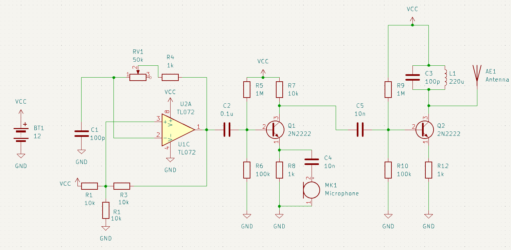

# AM transmitter

Hacked together a simple AM transmitter using TL072 op-amp and a few transistors.
Op-amp is set up in a Schmitt trigger configuration for carrier wave, modulation is done on first transistor stage, mixing audio signal directly into emitter.

Control the carrier frequency by changing potentiometer RV1 value, oscillates fine up to 500-700kHz.
LC resonance circuit is tuned to 1Mhz, swapping out L1 to 1mH drops it down to 500k, seems to work better that way.
Also could use a RF choke in series in with antenna.

Noisy, hacky, but works.

# Schematic

# In action

https://github.com/user-attachments/assets/37ff2fcf-93d7-4676-9cc3-06e1a0cca169

https://github.com/user-attachments/assets/a755bae2-8aa4-43ad-b9ba-3d2b5560220b
